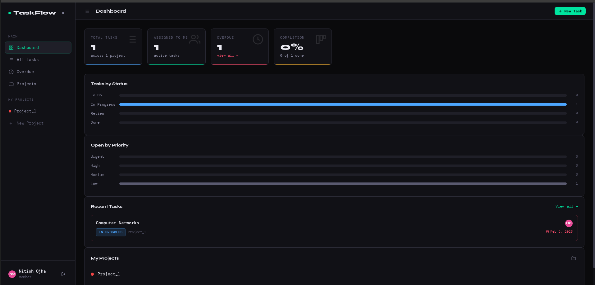
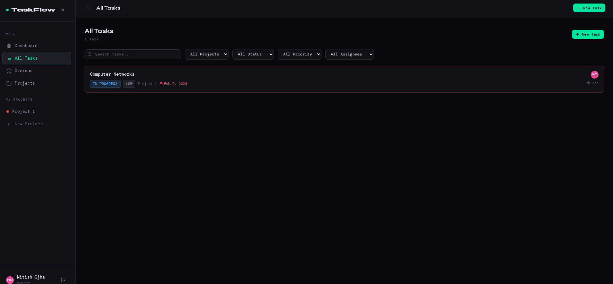
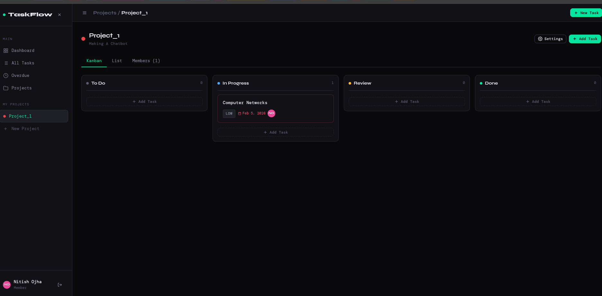

# TaskFlow — Team Task Manager

> A full-stack collaborative project management web app with role-based access control, kanban boards, real-time task tracking, and an analytics dashboard.


---

## Features

### Authentication
- Secure signup and login with JWT tokens
- Passwords hashed with bcryptjs (12 salt rounds)
- Session persists across page reloads via localStorage
- Protected routes — all API endpoints require a valid token

### Project Management
- Create, update, and delete projects with custom colors
- Invite team members by email address
- Assign roles — **Admin** or **Member** — per project
- Admin-only: edit project settings, manage members, delete project
- Owner-only: permanently delete a project and all its tasks

### Task Tracking
- Full CRUD on tasks within projects
- Four statuses: `To Do` → `In Progress` → `Review` → `Done`
- Four priority levels: `Low`, `Medium`, `High`, `Urgent`
- Assign tasks to project members, set due dates, add descriptions
- Comment threads on every task

### Views
- **Kanban board** — drag-free column view grouped by status
- **List view** — filterable flat list of all tasks
- **All Tasks page** — search and filter across all projects by status, priority, assignee
- **Overdue page** — all past-due tasks that aren't marked done

### Dashboard
- Stats cards: total tasks, tasks assigned to me, overdue count, completion percentage
- Tasks by status bar chart
- Open tasks by priority bar chart
- Recent tasks list
- My projects quick-nav

---

## Tech Stack

| Layer | Technology |
|-------|-----------|
| Frontend | Vanilla HTML, CSS, JavaScript (no framework) |
| Backend | Node.js, Express.js |
| Database | MongoDB Atlas (Mongoose ODM) |
| Auth | JSON Web Tokens (JWT) |
| Validation | express-validator |
| Frontend Deploy | Vercel |
| Backend Deploy | Render |

---

## Project Structure

```
Team_Task_Manager/
├── Backend/
│   ├── config/
│   │   └── db.js               # MongoDB connection
│   ├── middleware/
│   │   └── auth.js             # JWT protect + role guards
│   ├── models/
│   │   ├── User.js             # User schema (bcrypt, avatarColor)
│   │   ├── Project.js          # Project schema (members, roles)
│   │   └── Task.js             # Task schema (comments, isOverdue virtual)
│   ├── routes/
│   │   ├── auth.js             # POST /signup /login, GET/PUT /me
│   │   ├── projects.js         # Full CRUD + member management
│   │   ├── tasks.js            # Full CRUD + comments + dashboard
│   │   └── users.js            # User search by email/name
│   ├── .env                    # Environment variables (not committed)
│   ├── .env.example            # Environment variable template
│   ├── package.json
│   └── server.js               # Express app entry point
│
└── Frontend/
    ├── index.html              # App shell, router, state
    ├── styles.css              # All styles (CSS variables, dark theme)
    ├── api.js                  # Centralised fetch wrapper
    ├── utils.js                # Helpers: toast, avatar, dates, icons
    ├── auth.js                 # Login / signup UI
    ├── sidebar.js              # Sidebar + project nav renderer
    ├── dashboard.js            # Dashboard page renderer
    ├── projects.js             # Projects page, kanban, members tab
    └── tasks.js                # Tasks page, create/edit/detail modals
```

---

## Local Setup

### Prerequisites
- Node.js 18 or higher
- A [MongoDB Atlas](https://cloud.mongodb.com) account (free tier works)

### 1. Clone the repository

```bash
git clone https://github.com/Nitishojha00/team-task-manager.git
cd team-task-manager
```

### 2. Install backend dependencies

```bash
cd Backend
npm install
```

### 3. Configure environment variables

```bash
cp .env.example .env
```

Open `.env` and fill in your values:

```env
PORT=5000
NODE_ENV=development
MONGO_URI=mongodb+srv://<user>:<password>@cluster0.xxxxx.mongodb.net/taskflow
JWT_SECRET=your_super_secret_key_here
JWT_EXPIRES_IN=7d
FRONTEND_URL=http://localhost:3000
```

**Getting `MONGO_URI`:**
1. Log in to [MongoDB Atlas](https://cloud.mongodb.com)
2. Click your cluster → **Connect** → **Drivers**
3. Copy the connection string and replace `<password>` with your database user's password

**Generating `JWT_SECRET`:**
```bash
node -e "console.log(require('crypto').randomBytes(64).toString('hex'))"
```

### 4. Start the backend server

```bash
npm run dev       # development (nodemon)
# or
npm start         # production
```

Server runs at `http://localhost:5000`

### 5. Open the frontend

Open `Frontend/index.html` directly in your browser, or serve it with any static file server:

```bash
npx serve Frontend
```

> The frontend's `api.js` automatically points to `http://localhost:5000/api` in development and to the Render backend URL in production.

---

## API Reference

### Auth

| Method | Endpoint | Body | Description |
|--------|----------|------|-------------|
| POST | `/api/auth/signup` | `{ name, email, password }` | Create account |
| POST | `/api/auth/login` | `{ email, password }` | Login, receive JWT |
| GET | `/api/auth/me` | — | Get current user |
| PUT | `/api/auth/me` | `{ name?, avatarColor? }` | Update profile |

### Projects

| Method | Endpoint | Auth | Description |
|--------|----------|------|-------------|
| GET | `/api/projects` | Any member | List my projects |
| POST | `/api/projects` | Authenticated | Create project |
| GET | `/api/projects/:id` | Member | Get project + role |
| PUT | `/api/projects/:id` | Admin | Update project |
| DELETE | `/api/projects/:id` | Owner | Delete project + tasks |
| POST | `/api/projects/:id/members` | Admin | Add member by email |
| DELETE | `/api/projects/:id/members/:userId` | Admin | Remove member |
| PUT | `/api/projects/:id/members/:userId/role` | Admin | Change member role |

### Tasks

| Method | Endpoint | Auth | Description |
|--------|----------|------|-------------|
| GET | `/api/tasks` | Member | List tasks (filters: project, status, priority, assignee, overdue, search) |
| GET | `/api/tasks/dashboard` | Authenticated | Dashboard stats + charts data |
| GET | `/api/tasks/:id` | Member | Get task details + comments |
| POST | `/api/tasks` | Member | Create task |
| PUT | `/api/tasks/:id` | Member | Update task |
| DELETE | `/api/tasks/:id` | Creator or Admin | Delete task |
| POST | `/api/tasks/:id/comments` | Member | Add comment |

---

## Role-Based Access Control

| Action | Member | Admin | Owner |
|--------|--------|-------|-------|
| View project & tasks | ✅ | ✅ | ✅ |
| Create tasks | ✅ | ✅ | ✅ |
| Update any task | ✅ | ✅ | ✅ |
| Delete own tasks | ✅ | ✅ | ✅ |
| Delete any task | ❌ | ✅ | ✅ |
| Edit project settings | ❌ | ✅ | ✅ |
| Add / remove members | ❌ | ✅ | ✅ |
| Change member roles | ❌ | ✅ | ✅ |
| Delete project | ❌ | ❌ | ✅ |

---

## Deployment — Vercel (Frontend) + Render (Backend)

> **Note:** The assignment recommends Railway for deployment. However, as a student with no billing setup, I opted for **Vercel + Render** — both are completely free with no credit card required and fully support this stack. The app is live, functional, and production-ready on these platforms.

### 1. Push to GitHub

```bash
git add .
git commit -m "initial commit"
git push origin main
```

---

### 2. Deploy Backend on Render

1. Go to [render.com](https://render.com) and sign in (free account)
2. Click **New +** → **Web Service**
3. Connect your GitHub repository
4. Configure the service:
   - **Name:** `taskflow-backend` (or any name)
   - **Root Directory:** `Backend`
   - **Runtime:** `Node`
   - **Build Command:** `npm install`
   - **Start Command:** `node server.js`
   - **Instance Type:** Free

5. Add environment variables under **Environment**:

```
MONGO_URI        = mongodb+srv://...
JWT_SECRET       = your_secret
JWT_EXPIRES_IN   = 7d
NODE_ENV         = production
PORT             = 5000
FRONTEND_URL     = https://your-app.vercel.app
```

6. Click **Create Web Service** — Render will build and deploy automatically.
7. Copy your backend URL (e.g., `https://taskflow-backend.onrender.com`) — you'll need it for the frontend.

> **Note:** On Render's free tier, the service spins down after 15 minutes of inactivity. The first request after idle may take ~30 seconds to wake up.

---

### 3. Update Frontend API URL

In `Frontend/api.js`, make sure the production base URL points to your Render backend:

```js
const BASE_URL = window.location.hostname === 'localhost'
  ? 'http://localhost:5000/api'
  : 'https://taskflow-backend.onrender.com/api'; // ← your Render URL
```

---

### 4. Deploy Frontend on Vercel

1. Go to [vercel.com](https://vercel.com) and sign in (free account)
2. Click **Add New** → **Project**
3. Import your GitHub repository
4. Configure the project:
   - **Root Directory:** `Frontend`
   - **Framework Preset:** Other (no framework)
   - **Build Command:** *(leave empty)*
   - **Output Directory:** `.` (dot — serves files as-is)
5. Click **Deploy**

Vercel will give you a live URL like `https://team-task-manager-seven-lake.vercel.app`.

6. Go back to Render → your backend service → **Environment** and update:

```
FRONTEND_URL = https://team-task-manager-seven-lake.vercel.app
```

Then trigger a redeploy on Render so the CORS setting updates.

---

### 5. Done! 🎉

Your app is now live:

| Layer | Platform | URL |
|-------|----------|-----|
| Frontend | Vercel | `https://your-app.vercel.app` |
| Backend API | Render | `https://taskflow-backend.onrender.com` |
| Database | MongoDB Atlas | Cloud-hosted |

---

## Environment Variables Reference

| Variable | Required | Description |
|----------|----------|-------------|
| `MONGO_URI` | ✅ | MongoDB Atlas connection string |
| `JWT_SECRET` | ✅ | Secret key for signing JWT tokens |
| `JWT_EXPIRES_IN` | ✅ | Token expiry (e.g. `7d`, `24h`) |
| `PORT` | ✅ | Server port (Render sets this automatically) |
| `NODE_ENV` | ✅ | `development` or `production` |
| `FRONTEND_URL` | ✅ | Vercel frontend URL — used to allow CORS |

---

## Screenshots

> *(Add screenshots of dashboard, kanban board, and task detail modal here)*



---

## Author

**Nitish** — built as part of a full-stack assignment

---

## License

This project is for educational purposes.